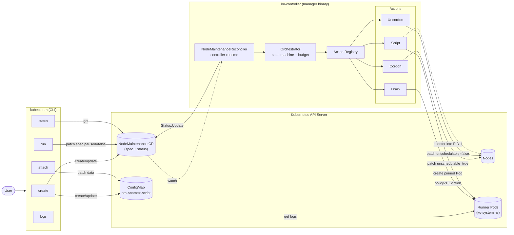
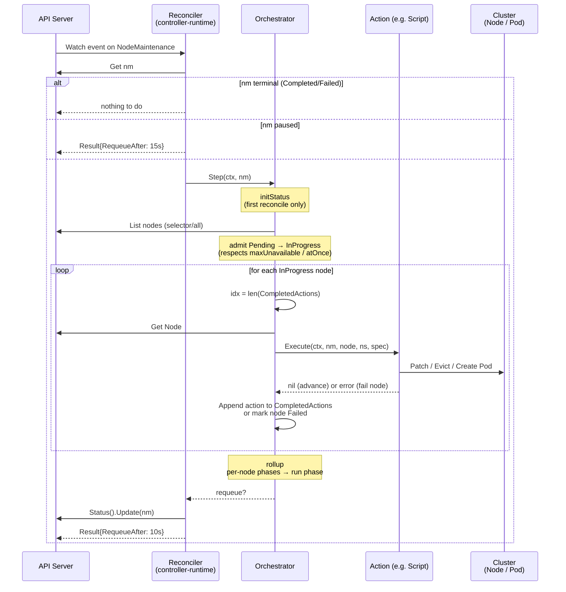
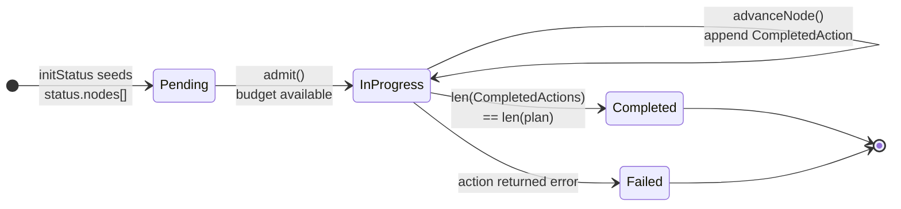

# klusterOne (`ko-controller`)

A Kubernetes-native operator + CLI for declaratively running **a user-supplied script on a set of nodes** under safety constraints (cordon, optional drain, max-unavailable budget, parallel "at-once" mode).

The unit of work is a single `NodeMaintenance` (`nm`) custom resource. You attach a shell script to it, choose where it runs (a label selector, an explicit node list, or every node), choose how aggressively it rolls out, and the controller takes care of the rest — cordon, run the script on the host via `nsenter`, capture exit code + logs into status, uncordon.

## What you get

- **CRD**: `nodemaintenances.ko.io` (cluster-scoped, short name `nm`).
- **Controller** (`ko-controller`): reconciles `NodeMaintenance` objects.
- **CLI** (`kubectl-nm`, plugin-style): build, attach, run, status, logs.

## Quickstart

```bash
# 1. Install the CRD + controller
make install-crd
make build && ./bin/ko-controller --runner-namespace ko-system
# (in another shell)
make install-cli   # places kubectl-nm on $PATH (use DEST=... to relocate)

# 2. Run an ad-hoc script on every worker, max 2 unavailable at a time
kubectl nm create patch-kernel \
  --script ./scripts/01.sh \
  --selector node-role.kubernetes.io/worker= \
  --max-unavailable 2

# 3. Watch progress
kubectl nm status patch-kernel
kubectl nm logs patch-kernel --node ip-10-0-1-7 -f
```

## CLI overview

```text
kubectl nm create <name> [flags]   build & apply a NodeMaintenance
kubectl nm attach <name> <script>  overwrite the script ConfigMap for an existing NM
kubectl nm run    <name>           unpause an existing NM (flips spec.paused=false)
kubectl nm status <name>           pretty-print phase + per-node table
kubectl nm logs   <name> [--node X] [-f]
                                   stream runner-pod logs
```

### `kubectl nm create` flags

| Flag                | Meaning                                                              |
| ------------------- | -------------------------------------------------------------------- |
| `--script PATH`     | Read script from a file (creates a ConfigMap in the runner namespace) |
| `--inline STR`      | Use `STR` as the script body (mutually exclusive with `--script`)    |
| `--all-nodes`       | Target every node in the cluster                                     |
| `--at-once`         | Run on all targeted nodes in parallel (overrides `--max-unavailable`)|
| `--max-unavailable N` | Maximum nodes in-flight (default 1)                                |
| `--selector k=v,…`  | Label selector for target nodes                                      |
| `--nodes a,b,c`     | Explicit node names                                                  |
| `--cordon` / `--uncordon` | Wrap the script with Cordon/Uncordon actions (both default true) |
| `--drain`           | Insert a Drain action between Cordon and Script                      |
| `--timeout DURATION`| Per-node script execution timeout (default 10m)                      |
| `--image IMG`       | Runner container image (default `alpine:3.19`)                       |
| `--in-pod`          | Run the script inside the runner Pod (skip `nsenter` to host)        |
| `--namespace NS`    | Runner namespace where the script ConfigMap is created (default `ko-system`) |
| `--paused`          | Create paused; flip with `kubectl nm run`                            |
| `--dry-run` / `-o`  | Print the generated NodeMaintenance YAML and exit                    |

### Two-phase workflow (attach → run)

```bash
# Create the NM in paused mode (placeholder ConfigMap)
kubectl nm create rolling-patch --inline ':' --selector role=worker --paused

# Drop in (or replace) the real script later
kubectl nm attach rolling-patch ./scripts/01.sh

# Kick it off
kubectl nm run rolling-patch
```

`attach` only touches the backing ConfigMap; the NM object itself is unchanged, so this is a safe operation while the run is paused.

## Architecture

### Components & data flow



The system has three independently-evolving pieces:

- **`kubectl-nm` CLI** — does plain API-server writes (`NodeMaintenance` CRs, the script ConfigMap, paused-flag patches). It never talks to the controller directly; it only mutates the desired state.
- **`ko-controller`** — a controller-runtime manager watching `NodeMaintenance`. The reconciler is intentionally thin; it delegates one **Step** to the orchestrator per reconcile.
- **Action Registry** — pluggable units (`Cordon`, `Drain`, `Uncordon`, `Script`) keyed by `ActionType`. The orchestrator never knows what an action *does* — only that `Execute` either succeeds or fails for one node.

### What happens in one reconcile



Two important invariants come out of this loop:

- **One action per node per Step.** `advanceNode` runs exactly one action then returns, so even a `[Cordon, Drain, Script, Uncordon]` chain takes four reconciles per node. This keeps the status update small and lets the budget rebalance between steps.
- **Actions must be idempotent.** Crashes, conflict retries, or controller restarts will re-Execute a half-finished action. That's why every action checks "am I already in the desired state?" before mutating (`Cordon` looks at `node.Spec.Unschedulable`, `Script` `Get`s the pod by deterministic name and reuses it, `Drain` re-lists and re-evicts).

### Per-node phase lifecycle



The run-level `status.phase` is just a `rollup` of these per-node phases: `InProgress` while any node is non-terminal, `Failed` if any node ended `Failed`, otherwise `Completed`. A `Failed` node intentionally **stops mid-chain** — if `Drain` fails the `Script` and `Uncordon` after it are skipped, so the cluster operator sees the cordon still in place as a "do not auto-recover" signal.

## How the Script action works

For each in-flight node, the controller materializes a privileged runner Pod with:

- `spec.nodeName: <target>` (bypasses the scheduler — important: the node is already cordoned)
- `tolerations: [{operator: Exists}]` (so it lands on tainted/cordoned nodes)
- `hostPID`, `hostNetwork`, `hostIPC` (default `runOnHost: true`)
- An init container that copies the script from the ConfigMap onto a hostPath dir
- A main container that runs `nsenter --target 1 --mount --uts --ipc --net --pid -- /bin/sh /var/lib/ko-controller/scripts/<id>.sh`

The action blocks until the Pod reaches Succeeded or Failed. On failure, the last log chunk is captured into `status.nodes[*].message` and the per-node exit code into `status.nodes[*].scriptExitCode`. Failed nodes stay cordoned (a follow-up Uncordon action is skipped).

Pass `runOnHost: false` (CLI: `--in-pod`) to keep execution inside the Pod's own namespaces — useful for "API-side" scripts that only need a kubeconfig.

## Spec reference (abridged)

```yaml
apiVersion: ko.io/v1alpha1
kind: NodeMaintenance
metadata:
  name: rolling-patch
spec:
  paused: false
  allNodes: false                   # if true, ignores nodeSelector/nodeNames
  nodeSelector:                     # OR nodeNames, OR allNodes
    role: worker
  script:
    configMapRef:
      name: rolling-patch-script
      namespace: ko-system          # defaults to controller --runner-namespace
      key: script.sh                # defaults to "script.sh"
    # OR:
    # inline: |
    #   #!/bin/sh
    #   ...
    image: alpine:3.19              # default
    timeoutSeconds: 600
    runOnHost: true                 # default — nsenter into PID 1
    env:
      - { name: GREETING, value: hello }
  strategy:
    maxUnavailable: 2               # default 1
    atOnce: false                   # if true, overrides maxUnavailable
  actions:                          # defaults to [Cordon, Script, Uncordon]
    - type: Cordon
    - type: Drain
      drainOptions: { ignoreDaemonSets: true, timeoutSeconds: 300 }
    - type: Script
    - type: Uncordon
status:
  phase: InProgress                 # Pending | InProgress | Completed | Failed
  startTime: 2026-05-24T10:00:00Z
  nodes:
    - name: ip-10-0-1-7
      phase: InProgress
      currentAction: Script
      completedActions: [Cordon]
      scriptPodName: nm-rolling-patch-ip-10-0-1-7
      scriptExitCode: 0
      lastTransitionTime: 2026-05-24T10:00:42Z
```

## Layout

```
.
├── api/v1alpha1/                 # CRD Go types + deepcopy
├── cmd/
│   ├── manager/                  # ko-controller binary
│   └── kubectl-nm/               # kubectl plugin binary
├── config/
│   ├── crd/                      # CRD manifest
│   └── samples/                  # Example NodeMaintenance objects
├── internal/
│   ├── actions/                  # Cordon, Drain, Uncordon, Script
│   ├── cli/                      # kubectl-nm subcommands
│   ├── controller/               # controller-runtime reconciler
│   └── orchestrator/             # state machine + maxUnavailable/atOnce gate
├── Dockerfile
├── Makefile
└── go.mod
```
