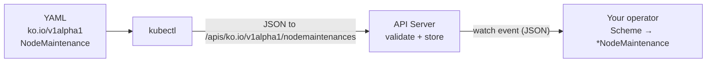
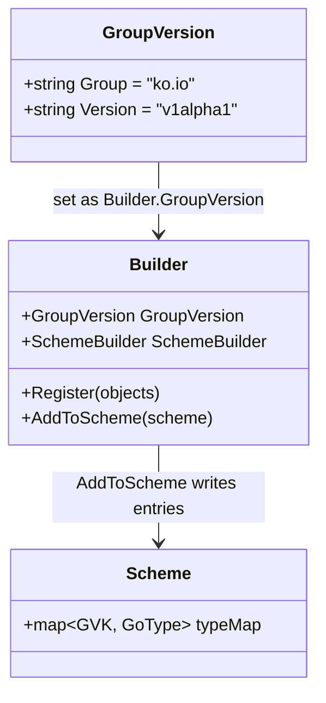
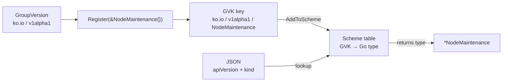
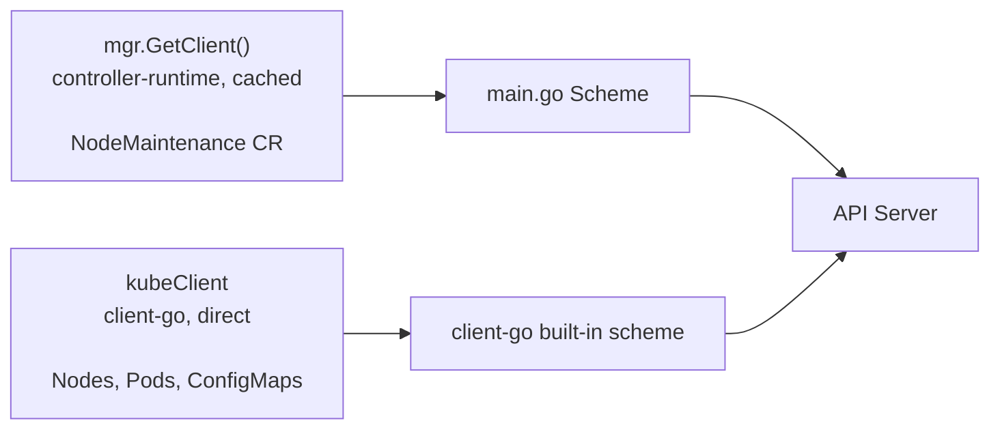
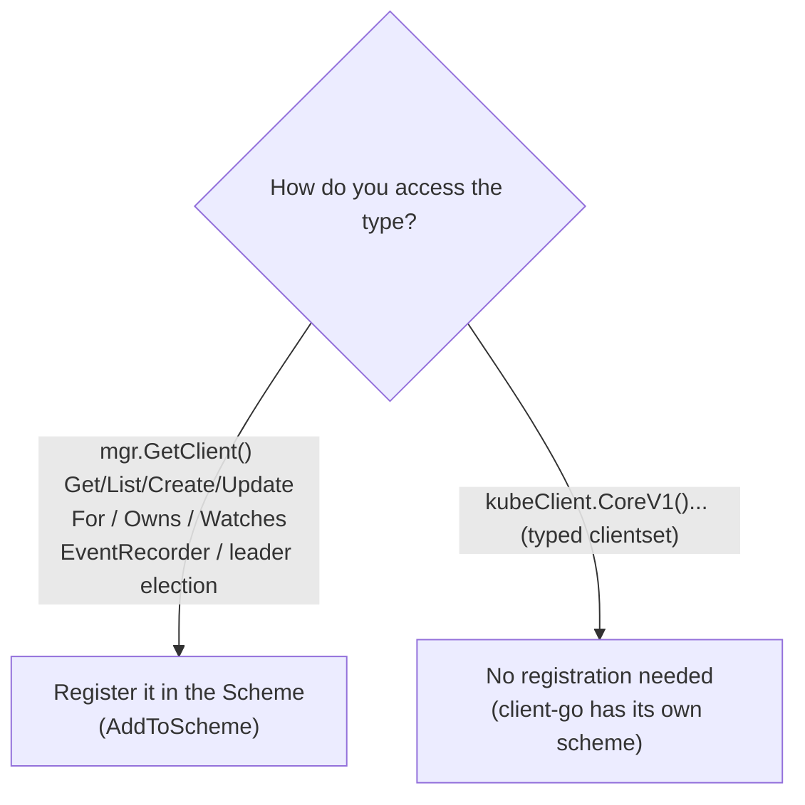

# API request lifecycle: from `kubectl apply` to your Go struct

How a `NodeMaintenance` YAML becomes a typed `*NodeMaintenance` inside your controller.

## The core idea

Your YAML says `apiVersion: ko.io/v1alpha1` and `kind: NodeMaintenance`. `kubectl` doesn't know the URL for that kind, so it **asks the API server** (discovery), gets back the resource name `nodemaintenances`, builds the URL `/apis/ko.io/v1alpha1/nodemaintenances`, and sends the object there as JSON. Your operator watches that same URL and uses the **Scheme** to decode the JSON into a Go struct.

> **The CRD tells the server the URL. The Scheme tells your code the type.**




## 1. The two fields that decide the destination

```yaml
apiVersion: ko.io/v1alpha1   # Group (ko.io) + Version (v1alpha1)
kind: NodeMaintenance        # Kind
```

Together these are the **GVK** (Group-Version-Kind) - the unique identity of the type.

## 2. How `kubectl` finds the endpoint

`kubectl` hard-codes nothing; it assembles the URL from two sources:

- **The server address** (`https://...:6443`) and credentials come from your **kubeconfig**.
- **The path** comes from **discovery** - `kubectl` asks the cluster what resources exist:

```
GET /apis/ko.io/v1alpha1
```

The reply maps your **Kind → resource (plural)**, which is the part used in URLs:

```
NodeMaintenance   ──►   nodemaintenances
```

That mapping exists because you applied the **CRD** (`[ko.io_nodemaintenances.yaml](../config/crd/ko.io_nodemaintenances.yaml)`) - its `plural: nodemaintenances` and `scope: Cluster` are exactly what discovery reports. So the final URL is:

```
/apis/ko.io/v1alpha1/nodemaintenances              # the collection
/apis/ko.io/v1alpha1/nodemaintenances/<name>       # one object
```

(Namespaced kinds add `/namespaces/<ns>/` before the plural; `NodeMaintenance` is cluster-scoped, so it doesn't.)

### See it yourself

`kubectl api-resources` is just the human-readable view of that discovery data:

```bash
kubectl api-resources | grep -i nodemaintenance
```

```
NAME              SHORTNAMES   APIVERSION       NAMESPACED   KIND
nodemaintenances  nm           ko.io/v1alpha1   false        NodeMaintenance
```

The URL is built from these columns: `/apis/<APIVERSION>/<NAME>`. (It only lists kinds the server already knows, so the CRD must be applied first.)

To watch `kubectl` build and call the real URL:

```bash
kubectl get nodemaintenances -v=8
```


## 3. The request on the wire

`kubectl apply` sends the object as JSON to that URL:

```http
PATCH /apis/ko.io/v1alpha1/nodemaintenances/drain-gpu-nodes HTTP/1.1
Host: 127.0.0.1:6443
Authorization: Bearer <token from kubeconfig>
Content-Type: application/apply-patch+yaml

{
  "apiVersion": "ko.io/v1alpha1",
  "kind": "NodeMaintenance",
  "metadata": { "name": "drain-gpu-nodes" },
  "spec": { "nodeNames": ["node-a", "node-b"],
            "script": { "inline": "#!/bin/sh\necho hi\n" } }
}
```

The API server checks RBAC, validates against the CRD schema, applies defaults (e.g. `paused: false`), stores it in etcd, and emits a **watch event** to anyone watching this resource.

## 4. How it reaches your controller - the Scheme

Your operator watches that same URL via `For(&NodeMaintenance{})`:

```197:199:internal/controller/nodemaintenance_controller.go
	return ctrl.NewControllerManagedBy(mgr).
		For(&kov1alpha1.NodeMaintenance{}).
		Complete(r)
```

When the watch event arrives as JSON, the **Scheme** reads `apiVersion + kind` and looks up which Go type to build. That lookup table is defined in `groupversion_info.go`:

```12:25:api/v1alpha1/groupversion_info.go
var (
	// GroupVersion is the group/version used to register these objects.
	GroupVersion = schema.GroupVersion{Group: "ko.io", Version: "v1alpha1"}

	// SchemeBuilder is used to add go types to the GroupVersionKind scheme.
	SchemeBuilder = &scheme.Builder{GroupVersion: GroupVersion}

	// AddToScheme adds the types in this group-version to the given scheme.
	AddToScheme = SchemeBuilder.AddToScheme
)

func init() {
	SchemeBuilder.Register(&NodeMaintenance{}, &NodeMaintenanceList{})
}
```


### How SchemeBuilder fills the table

Quick summary of the four lines:


| Line                                                          | Role                                             |
| ------------------------------------------------------------- | ------------------------------------------------ |
| `GroupVersion = {ko.io, v1alpha1}`                            | the group/version **prefix** (just data)         |
| `SchemeBuilder = &scheme.Builder{GroupVersion: GroupVersion}` | **plugs that prefix into a builder**             |
| `SchemeBuilder.Register(&NodeMaintenance{})`                  | prefix **+ Kind = full GVK**, collected          |
| `AddToScheme(scheme)`                                         | **writes** the collected entries into the Scheme |


#### The data structures




`GroupVersion` is plain data. `&scheme.Builder{GroupVersion: GroupVersion}` copies it into the `Builder.GroupVersion` field so the builder carries the prefix. `Register` then adds Kind→type pairs, and `AddToScheme` writes them into the `Scheme`.

> **Where does the Kind name come from?**
>
> You don't type the Kind anywhere. `Register(&NodeMaintenance{})` is given a Go struct, and Kubernetes just uses the **struct's name** as the Kind. So the struct `NodeMaintenance` becomes `kind: NodeMaintenance`. That's why the `kind` in your YAML has to match the struct name.
>
> There are two structs because there are two shapes of response:
>
> - one object → `kind: NodeMaintenance`
> - a list of objects (from `kubectl get`) → `kind: NodeMaintenanceList`


#### The flow




1. `GroupVersion` supplies the prefix; `Register` derives the Kind from the Go type's name (`NodeMaintenance`) to form the full **GVK key**.
2. `AddToScheme` writes that key → Go type into the **Scheme table**.
3. Incoming **JSON** uses the same key (`apiVersion + kind`); the Scheme returns the Go type and the bytes decode into `*NodeMaintenance`.

`main.go` is what actually calls `AddToScheme` at boot, handing the filled Scheme to the manager so every client and watch can decode your CRD:

```37:40:cmd/manager/main.go
func init() {
	utilruntime.Must(clientgoscheme.AddToScheme(scheme)) //Adding built-in k8s resources to the scheme...
	utilruntime.Must(kov1alpha1.AddToScheme(scheme))     //Adding our custom resource to the scheme...
```

The decode happens when your reconciler calls `r.Get` with an empty struct - the client uses the Scheme to fill it:

```99:102:internal/controller/nodemaintenance_controller.go
	var nm kov1alpha1.NodeMaintenance
	if err := r.Get(ctx, req.NamespacedName, &nm); err != nil {
		return ctrl.Result{}, client.IgnoreNotFound(err)
	}
```

From here your reconciler works with a typed Go object, never raw JSON.

## 5. Two clients, two schemes

A common point of confusion: `main.go` registers **native** Kubernetes types in the Scheme too...

```37:39:cmd/manager/main.go
func init() {
	utilruntime.Must(clientgoscheme.AddToScheme(scheme)) //Adding built-in k8s resources to the scheme...
	utilruntime.Must(kov1alpha1.AddToScheme(scheme))     //Adding our custom resource to the scheme...
```

...even though native resources (Nodes, Pods, ConfigMaps) are handled by a different client. The reason is that there are **two separate clients**, and each uses its own scheme:



So why register native types in the `main.go` Scheme if `kubeClient` never reads it?

Because **that Scheme belongs to the controller-runtime client and the manager**, not to `kubeClient`. The manager itself needs native types for things like emitting Events and leader election, and the moment you watch or read a native type through the cached client (for example `.Owns(&corev1.Pod{})`), it must find that type in the Scheme - otherwise you get `no kind is registered for the type v1.Pod`.


|               | `mgr.GetClient()` (controller-runtime) | `kubeClient` (client-go)           |
| ------------- | -------------------------------------- | ---------------------------------- |
| Style         | generic `Get(ctx, key, obj)`           | typed `CoreV1().Pods(ns).Get(...)` |
| Reads from    | local cache (fast)                     | API server directly (always fresh) |
| Which scheme  | the `main.go` Scheme                   | client-go's built-in scheme        |
| Used here for | the `NodeMaintenance` CR               | Nodes, Pods, ConfigMaps            |


In short: `clientgoscheme.AddToScheme` teaches the **controller-runtime** side about native types; `kubeClient` doesn't need it because it ships with client-go's built-in scheme.

### Which operations actually use the Scheme (in this repo)

The controller-runtime client is used in exactly **four** places, and every one of them is the `NodeMaintenance` CR:


| Operation                          | Where              | Why it needs the Scheme                                                                                            |
| ---------------------------------- | ------------------ | ------------------------------------------------------------------------------------------------------------------ |
| `For(&NodeMaintenance{})`          | `SetupWithManager` | Starts an informer that watches the CR; the Scheme tells it how to decode the JSON stream into `*NodeMaintenance`. |
| `r.Get(ctx, ..., &nm)`             | `Reconcile`        | You pass an empty struct; the Scheme finds its GVK (which cache to read) and decodes into it.                      |
| `r.Status().Update(ctx, &nm)` (x2) | `Reconcile`        | To write, the Scheme finds the GVK to build the URL and encode the body.                                           |


All four are satisfied by `kov1alpha1.AddToScheme`. The native types registered by `clientgoscheme.AddToScheme` sit in the `main.go` Scheme but no current operation reads them.


### Is the native registration (`clientgoscheme`) actually needed here?

For the code as it stands today: **no - removing it does not break anything.** None of the manager features that require native types are active:


| Manager feature                 | Needs native types? | Active in this repo?                  |
| ------------------------------- | ------------------- | ------------------------------------- |
| Leader election                 | yes (`Lease`)       | No (not set in `ctrl.Options`)        |
| EventRecorder                   | yes (`Event`)       | No (never call `GetEventRecorderFor`) |
| `.Owns()` / `.Watches()` native | yes                 | No (only `.For(NodeMaintenance)`)     |
| Health / metrics                | no                  | Yes, but they don't touch the Scheme  |


> **Keep it anyway.** It's the standard kubebuilder convention, costs nothing at runtime, and is a one-line safeguard: the day you add `.Owns(&corev1.Pod{})` to watch runner Pods (or record Events on the NM), it becomes required - without it you'd hit `no kind is registered for the type v1.Pod in scheme` at runtime.

### Rule of thumb: when does a type need to be in the Scheme?

A type must be registered in the `main.go` Scheme whenever you touch it through the **controller-runtime client or manager**. If you only touch it through `kubeClient`, it does not.



Concretely, register a type when you:

- read/write it with `mgr.GetClient()` (the cached client), or
- watch it via `For(...)`, `Owns(...)`, or `Watches(...)`, or
- enable manager features that create native objects (EventRecorder, leader election).

For this repo that means: **the CR (`kov1alpha1.AddToScheme`) is required**; the native registration is optional today but kept for the moment you start watching native objects through controller-runtime.

