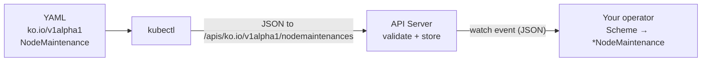

# API request lifecycle: from `kubectl apply` to your Go struct

How a `NodeMaintenance` YAML becomes a typed `*NodeMaintenance` inside your controller.

## The core idea

Your YAML says `apiVersion: ko.io/v1alpha1` and `kind: NodeMaintenance`. `kubectl` doesn't know the URL for that kind, so it **asks the API server** (discovery), gets back the resource name `nodemaintenances`, builds the URL `/apis/ko.io/v1alpha1/nodemaintenances`, and sends the object there as JSON. Your operator watches that same URL and uses the **Scheme** to decode the JSON into a Go struct.

> **The CRD tells the server the URL. The Scheme tells your code the type.**



## 1. The two fields that decide the destination

```yaml
apiVersion: ko.io/v1alpha1   # Group (ko.io) + Version (v1alpha1)
kind: NodeMaintenance        # Kind
```

Together these are the **GVK** (Group-Version-Kind) - the unique identity of the type.

## 2. How `kubectl` finds the endpoint

`kubectl` hard-codes nothing; it assembles the URL from two sources:

- **The server address** (`https://...:6443`) and credentials come from your **kubeconfig**.
- **The path** comes from **discovery** - `kubectl` asks the cluster what resources exist:

```
GET /apis/ko.io/v1alpha1
```

The reply maps your **Kind → resource (plural)**, which is the part used in URLs:

```
NodeMaintenance   ──►   nodemaintenances
```

That mapping exists because you applied the **CRD** ([`ko.io_nodemaintenances.yaml`](../config/crd/ko.io_nodemaintenances.yaml)) - its `plural: nodemaintenances` and `scope: Cluster` are exactly what discovery reports. So the final URL is:

```
/apis/ko.io/v1alpha1/nodemaintenances              # the collection
/apis/ko.io/v1alpha1/nodemaintenances/<name>       # one object
```

(Namespaced kinds add `/namespaces/<ns>/` before the plural; `NodeMaintenance` is cluster-scoped, so it doesn't.)

### See it yourself

`kubectl api-resources` is just the human-readable view of that discovery data:

```bash
kubectl api-resources | grep -i nodemaintenance
```

```
NAME              SHORTNAMES   APIVERSION       NAMESPACED   KIND
nodemaintenances  nm           ko.io/v1alpha1   false        NodeMaintenance
```

The URL is built from these columns: `/apis/<APIVERSION>/<NAME>`. (It only lists kinds the server already knows, so the CRD must be applied first.)

To watch `kubectl` build and call the real URL:

```bash
kubectl get nodemaintenances -v=8
```

## 3. The request on the wire

`kubectl apply` sends the object as JSON to that URL:

```http
PATCH /apis/ko.io/v1alpha1/nodemaintenances/drain-gpu-nodes HTTP/1.1
Host: 127.0.0.1:6443
Authorization: Bearer <token from kubeconfig>
Content-Type: application/apply-patch+yaml

{
  "apiVersion": "ko.io/v1alpha1",
  "kind": "NodeMaintenance",
  "metadata": { "name": "drain-gpu-nodes" },
  "spec": { "nodeNames": ["node-a", "node-b"],
            "script": { "inline": "#!/bin/sh\necho hi\n" } }
}
```

The API server checks RBAC, validates against the CRD schema, applies defaults (e.g. `paused: false`), stores it in etcd, and emits a **watch event** to anyone watching this resource.

## 4. How it reaches your controller - the Scheme

Your operator watches that same URL via `For(&NodeMaintenance{})`:

```197:199:internal/controller/nodemaintenance_controller.go
	return ctrl.NewControllerManagedBy(mgr).
		For(&kov1alpha1.NodeMaintenance{}).
		Complete(r)
```

When the watch event arrives as JSON, the **Scheme** reads `apiVersion + kind` and looks up which Go type to build. That lookup table is defined in `groupversion_info.go`:

```12:25:api/v1alpha1/groupversion_info.go
var (
	// GroupVersion is the group/version used to register these objects.
	GroupVersion = schema.GroupVersion{Group: "ko.io", Version: "v1alpha1"}

	// SchemeBuilder is used to add go types to the GroupVersionKind scheme.
	SchemeBuilder = &scheme.Builder{GroupVersion: GroupVersion}

	// AddToScheme adds the types in this group-version to the given scheme.
	AddToScheme = SchemeBuilder.AddToScheme
)

func init() {
	SchemeBuilder.Register(&NodeMaintenance{}, &NodeMaintenanceList{})
}
```

The decode happens when your reconciler calls `r.Get` with an empty struct - the client uses the Scheme to fill it:

```99:102:internal/controller/nodemaintenance_controller.go
	var nm kov1alpha1.NodeMaintenance
	if err := r.Get(ctx, req.NamespacedName, &nm); err != nil {
		return ctrl.Result{}, client.IgnoreNotFound(err)
	}
```

From here your reconciler works with a typed Go object, never raw JSON.
