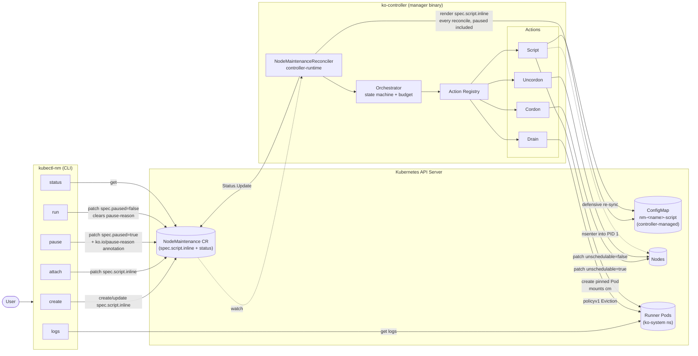
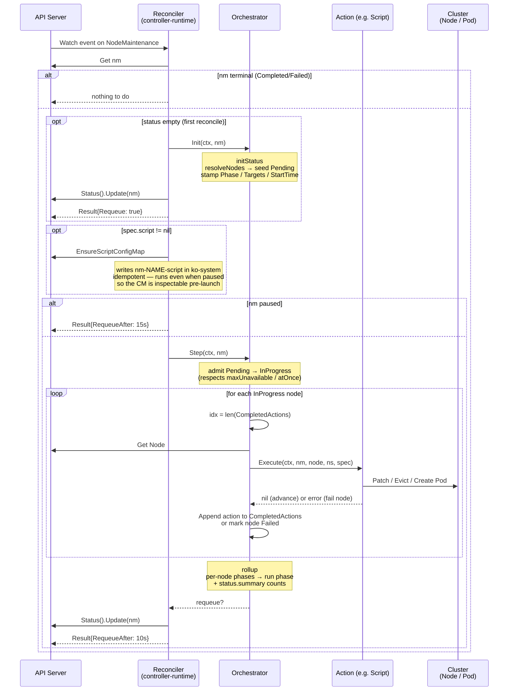
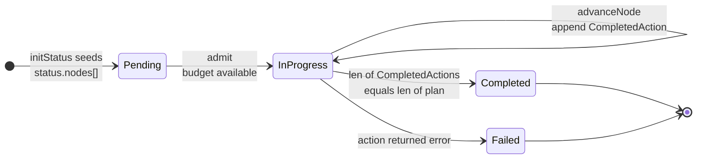

# Architecture

How `klusterOne` is laid out across the CLI, the controller, and the CRD,
plus the invariants that make the orchestrator reasonable to operate.

For the on-the-ground reconcile-by-reconcile walkthrough, see
[reconcile-flow.md](./reconcile-flow.md).

## Components & data flow

The system has three independently-evolving pieces:

- **`kubectl-nm` CLI** — does plain API-server writes against
  `NodeMaintenance` CRs only (script body lives on `spec.script.inline`,
  pause/run patches on `spec.paused`). The CLI never writes ConfigMaps
  in `ko-system`; the controller materializes them. See
  [cli.md](./cli.md) for the full reference and
  [security.md](./security.md) for the trust boundary.
- **`ko-controller`** — a controller-runtime manager watching
  `NodeMaintenance`. The reconciler is intentionally thin; it delegates one
  **Step** to the orchestrator per reconcile.
- **Action Registry** — pluggable units (`Cordon`, `Drain`, `Uncordon`,
  `Script`) keyed by `ActionType`. The orchestrator never knows what an
  action *does* — only that `Execute` either succeeds or fails for one
  node. See [script-action.md](./script-action.md) for how the Script
  action in particular materializes its runner Pod.

## What happens in one reconcile

Two important invariants come out of this loop:

- **One action per node per Step.** `advanceNode` runs exactly one action
  then returns, so even a `[Cordon, Drain, Script, Uncordon]` chain takes
  four reconciles per node. This keeps the status update small and lets
  the budget rebalance between steps.
- **Actions must be idempotent.** Crashes, conflict retries, or controller
  restarts will re-Execute a half-finished action. That's why every action
  checks "am I already in the desired state?" before mutating (`Cordon`
  looks at `node.Spec.Unschedulable`, `Script` `Get`s the pod by
  deterministic name and reuses it, `Drain` re-lists and re-evicts).

> For the same loop traced over six reconciles with concrete state
> snapshots and per-tick `kubectl get nm` output, see
> [reconcile-flow.md](./reconcile-flow.md).

## Per-node phase lifecycle

The run-level `status.phase` is just a `rollup` of these per-node phases:
`InProgress` while any node is non-terminal, `Failed` if any node ended
`Failed`, otherwise `Completed`. A `Failed` node intentionally **stops
mid-chain** — if `Drain` fails the `Script` and `Uncordon` after it are
skipped, so the cluster operator sees the cordon still in place as a "do
not auto-recover" signal.
