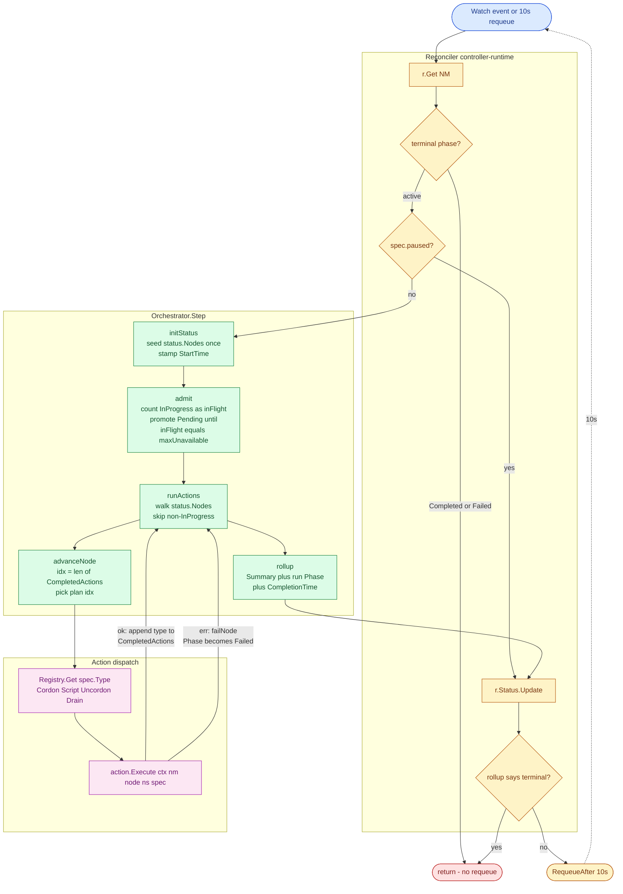
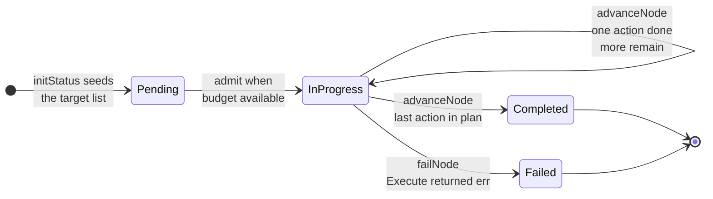
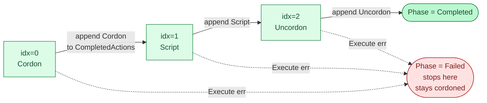
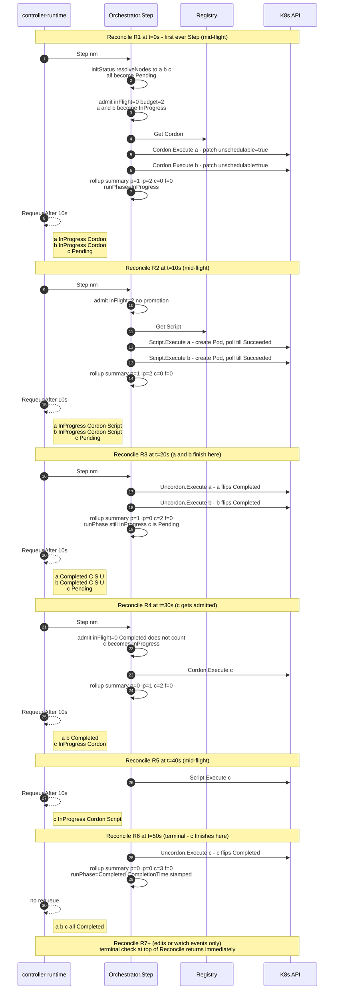

# Reconcile flow & per-node lifecycle

This doc traces what happens between `kubectl apply -f nm.yaml` and
`status.phase: Completed`, using a single concrete example end-to-end. Read
this when you want to understand:

- which function runs at which point in a reconcile,
- how the per-node phase machine and the action chain compose,
- why a multi-node run takes N reconciles (and not one),
- and how the `maxUnavailable` budget rebalances between reconciles.

For the component-level overview (CLI ↔ controller ↔ CRD), see
[architecture.md](./architecture.md). For the full CLI reference, see
[cli.md](./cli.md).

## The example we trace throughout

```yaml
apiVersion: ko.io/v1alpha1
kind: NodeMaintenance
metadata:
  name: demo
spec:
  nodeNames: [node-a, node-b, node-c]
  script:
    configMapRef:
      name: demo-script
  strategy:
    maxUnavailable: 2
  # spec.actions left empty → controller synthesizes [Cordon, Script, Uncordon]
```

- **3 target nodes**: `node-a`, `node-b`, `node-c`.
- **Budget**: `maxUnavailable: 2` → at most 2 nodes are `InProgress` at any time.
- **Action plan**: `[Cordon, Script, Uncordon]` (the default synthesized when
  `spec.actions` is empty but `script` is attached — see `EffectiveActions`).
- **Tick**: the controller requeues every 10s while there's still work, so
  reconcile boundaries are at `t = 0s, 10s, 20s, …`.

This run will take **6 reconciles ≈ 60 s** + however long each Script takes to
finish on the node.

## 1. What one reconcile does — the call graph



What to take away from this picture:

- **The Reconciler is thin.** It only loads the CR, decides whether to skip
  (terminal/paused), delegates one `Step` to the Orchestrator, persists status,
  and decides whether to requeue.
- **Step is a four-stage pipeline.** `initStatus` is one-shot (only does work
  on the first reconcile, no-op thereafter). `admit` then `runActions` then
  `rollup` runs every reconcile.
- **Action dispatch is one map lookup.** The Orchestrator never knows what an
  Action does — it only calls `Execute` and checks the error.

## 2. Per-node phase machine

Each node's `status.nodes[i].phase` independently walks this small state
machine. The labels on the transitions name the orchestrator function that
caused them:



The self-loop on `InProgress` is the heartbeat of the run: one tick (one
reconcile) advances each InProgress node by exactly one action.

## 3. The action chain as a nano-FSM

Within a single node, `advanceNode` walks the action plan one step at a time.
With the default `[Cordon, Script, Uncordon]` plan, the per-node action FSM
looks like this:



Critically: a node that **fails** in the middle of the chain **stops there**.
If `Script` fails on `node-a`, the orchestrator does **not** run the trailing
`Uncordon` — `node-a` stays cordoned as a "do not auto-recover" signal for
the operator. The other nodes are unaffected and continue.

## 4. The 3-node example, reconcile by reconcile

This sequence diagram shows every reconcile, every K8s API call the
orchestrator makes, and the resulting node states. The `Note over CR,K`
header at the top of each block names the reconcile and what kind of
transition happened in it; the `Note right of CR` at the bottom snapshots
the per-node state when the reconcile finishes.



## 5. Same trace as a swim-lane timeline

The swim-lane view makes the budget effect obvious at a glance: `node-c` is
**blocked on budget** for the first three reconciles, then runs serially after
`a` and `b` finish. Each cell below is one 10-second reconcile tick.

```text
              R1        R2        R3        R4        R5        R6
           t=0..10   t=10..20  t=20..30  t=30..40  t=40..50  t=50..60
          +---------+---------+---------+---------+---------+---------+
  node-a  | Cordon  | Script  | Uncordn |  done   |  done   |  done   |
          +---------+---------+---------+---------+---------+---------+
  node-b  | Cordon  | Script  | Uncordn |  done   |  done   |  done   |
          +---------+---------+---------+---------+---------+---------+
  node-c  | wait    | wait    | wait    | Cordon  | Script  | Uncordn |
          +---------+---------+---------+---------+---------+---------+
                ^                   ^         ^                   ^
                |                   |         |                   |
                budget full         |         budget freed:       run terminal:
                (a,b in-flight)     |         admit promotes c    rollup sets
                                    a,b flip to Completed         Phase=Completed
                                    at the end of R3
```

Things to notice from this layout:

- **Rows are nodes, columns are reconcile ticks.** Each column is one call
  to `Orchestrator.Step`.
- **`node-a` and `node-b` run in lock-step** because both were admitted at R1
  (budget was 2, both fit), and from then on `advanceNode` ticks them through
  the plan one action at a time.
- **`node-c` waits for three ticks** even though there's nothing wrong with it
  — the budget is purely a function of how many nodes are *currently*
  `InProgress`. The instant `a` and `b` transition to `Completed` at the end
  of R3, the next reconcile's `admit` sees `inFlight=0` and promotes `c`.
- **There is no parallelism between `a/b` and `c`.** With `maxUnavailable=2`
  and three target nodes, the second "batch" can't start until the first one
  fully drains. If you bumped `maxUnavailable` to 3 (or set `--at-once`), all
  three rows would start at R1 and the whole run would finish in 3 reconciles
  instead of 6.

## 6. Snapshot table — state at each reconcile boundary

| Tick | node-a                | node-b                | node-c                | summary (p/ip/c/f) | run Phase  |
|------|-----------------------|-----------------------|-----------------------|--------------------|------------|
| R#1  | InProgress, [C]       | InProgress, [C]       | Pending, []           | 1 / 2 / 0 / 0      | InProgress |
| R#2  | InProgress, [C,S]     | InProgress, [C,S]     | Pending, []           | 1 / 2 / 0 / 0      | InProgress |
| R#3  | **Completed, [C,S,U]**| **Completed, [C,S,U]**| Pending, []           | 1 / 0 / 2 / 0      | InProgress |
| R#4  | Completed             | Completed             | InProgress, [C]       | 0 / 1 / 2 / 0      | InProgress |
| R#5  | Completed             | Completed             | InProgress, [C,S]     | 0 / 1 / 2 / 0      | InProgress |
| R#6  | Completed             | Completed             | **Completed, [C,S,U]**| 0 / 0 / 3 / 0      | **Completed** |

`C, S, U` = `Cordon, Script, Uncordon`. The bracketed list is the node's
`status.nodes[i].completedActions`.

### What `kubectl get nm demo` shows at each tick

```text
# Right after R#1 (t≈10s)
NAME   PHASE        PAUSED   TARGETS                       DONE   TOTAL   AGE
demo   InProgress   false    nodes:node-a,node-b,node-c    0      3       10s

# After R#3 (t≈30s) — a and b just finished
NAME   PHASE        PAUSED   TARGETS                       DONE   TOTAL   AGE
demo   InProgress   false    nodes:node-a,node-b,node-c    2      3       30s

# After R#6 (t≈60s) — run terminal
NAME   PHASE        PAUSED   TARGETS                       DONE   TOTAL   AGE
demo   Completed    false    nodes:node-a,node-b,node-c    3      3       60s
```

The `Done`/`Total` columns are direct projections of `status.summary.completed`
and `status.summary.total`, which `rollup` recomputes from
`status.nodes[]` on every reconcile.

## 7. The budget math (why `node-c` waits)

`admit` runs **at the start of every reconcile** and rebalances. It only
cares about *currently-InProgress* nodes — Completed nodes free up budget for
the next Pending one.

| Tick | InProgress entering admit | inFlight | budget | promotions    | InProgress leaving admit |
|------|---------------------------|----------|--------|---------------|--------------------------|
| R#1  | —                         | 0        | 2      | a, b          | a, b                     |
| R#2  | a, b                      | 2        | 2      | none (full)   | a, b                     |
| R#3  | a, b                      | 2        | 2      | none (full)   | a, b                     |
| R#4  | — *(a, b → Completed)*    | 0        | 2      | **c**         | c                        |
| R#5  | c                         | 1        | 2      | none (no Pending left) | c               |
| R#6  | c                         | 1        | 2      | none          | c                        |

The promotion at R#4 is the key event: `node-c` could not start while `a` and
`b` were occupying both budget slots, but the moment they transitioned to
`Completed` at the end of R#3, the next reconcile's `admit` saw `inFlight=0`
and promoted `c`.

## 8. Source-of-truth: which function does what

The Orchestrator's pipeline lives in
[`internal/orchestrator/orchestrator.go`](../internal/orchestrator/orchestrator.go).
For quick reference:

```47:86:internal/orchestrator/orchestrator.go
func (o *Orchestrator) Step(ctx context.Context, nm *kov1alpha1.NodeMaintenance) (bool, error) {
	logger := log.FromContext(ctx).WithValues("nodeMaintenance", nm.Name)

	if err := o.initStatus(ctx, nm); err != nil {
		return false, fmt.Errorf("init status: %w", err)
	}

	o.admit(nm)

	if err := o.runActions(ctx, nm); err != nil {
		logger.Error(err, "action execution returned error; per-node status reflects details")
	}

	done := o.rollup(nm)
	return !done, nil
}
```

```203:217:internal/orchestrator/orchestrator.go
// runActions advances every InProgress node by exactly one action per Step.
// On error the node is marked Failed and other nodes are unaffected.
func (o *Orchestrator) runActions(ctx context.Context, nm *kov1alpha1.NodeMaintenance) error {
	var firstErr error
	for i := range nm.Status.Nodes {
		ns := &nm.Status.Nodes[i]
		if ns.Phase != kov1alpha1.PhaseInProgress {
			continue
		}
		if err := o.advanceNode(ctx, nm, ns); err != nil && firstErr == nil {
			firstErr = err
		}
	}
	return firstErr
}
```

```219:260:internal/orchestrator/orchestrator.go
// advanceNode runs the next un-completed action against a single node.
func (o *Orchestrator) advanceNode(ctx context.Context, nm *kov1alpha1.NodeMaintenance, ns *kov1alpha1.NodeStatus) error {
	logger := log.FromContext(ctx).WithValues("node", ns.Name)
	plan := EffectiveActions(&nm.Spec)
	idx := len(ns.CompletedActions)
	if idx >= len(plan) {
		now := metav1.Now()
		ns.Phase = kov1alpha1.PhaseCompleted
		ns.CurrentAction = ""
		ns.LastTransitionTime = &now
		return nil
	}

	spec := plan[idx]
	action, err := o.Registry.Get(spec.Type)
	if err != nil {
		return o.failNode(ns, fmt.Errorf("resolve action: %w", err))
	}

	node, err := o.Kube.CoreV1().Nodes().Get(ctx, ns.Name, metav1.GetOptions{})
	if err != nil {
		return o.failNode(ns, fmt.Errorf("get node: %w", err))
	}

	ns.CurrentAction = string(spec.Type)
	logger.Info("executing action", "action", spec.Type)

	if err := action.Execute(ctx, nm, node, ns, spec); err != nil {
		return o.failNode(ns, fmt.Errorf("%s: %w", spec.Type, err))
	}

	now := metav1.Now()
	ns.CompletedActions = append(ns.CompletedActions, string(spec.Type))
	ns.LastTransitionTime = &now
	ns.Message = ""

	if len(ns.CompletedActions) == len(plan) {
		ns.Phase = kov1alpha1.PhaseCompleted
		ns.CurrentAction = ""
	}
	return nil
}
```

The Registry that `advanceNode` dispatches through is defined in
[`internal/actions/action.go`](../internal/actions/action.go) and populated
at controller startup in
[`cmd/manager/main.go`](../cmd/manager/main.go).

## 9. Invariants worth memorizing

1. **One action per node per Step.** This is the single most important
   invariant. A `[Cordon, Drain, Script, Uncordon]` chain takes 4 reconciles
   per node, not 1. The benefit is small, frequent status writes that survive
   crashes.
2. **Actions must be idempotent.** Crashes, conflict retries, and controller
   restarts all re-Execute a half-finished action. `Cordon` checks
   `node.Spec.Unschedulable` first; `Script` reuses the runner Pod by
   deterministic name; `Drain` re-lists and re-evicts. Same is required for
   any action you add.
3. **`admit` is dynamic, not one-shot.** It runs every reconcile and
   recomputes `inFlight` each time. That's why `node-c` gets promoted the
   instant `node-a` and `node-b` transition to Completed — without any
   re-resolution of the target list (`initStatus` froze that at R#1).
4. **A Failed node stops mid-chain.** It does **not** continue to subsequent
   actions. This is intentional: a Drain failure leaves the node cordoned so
   the operator sees the cluster in a "needs attention" state instead of a
   silently-half-applied one.
5. **`status.phase` is a pure rollup.** It's not set anywhere except in
   `rollup`, where it's computed from the per-node phases each reconcile. If
   any node is non-terminal → `InProgress`; if any node is `Failed` →
   `Failed`; otherwise → `Completed`.

## 10. Variations worth knowing

- **`spec.strategy.atOnce: true`** — `effectiveBudget` returns
  `len(status.Nodes)`, so all nodes get promoted in R#1 and the run finishes
  in `len(plan)` reconciles instead of `len(plan) * ceil(N/maxUnavailable)`.
- **`spec.paused: true`** — Reconcile short-circuits between Steps and
  requeues at 15 s instead of 10 s. Whatever action was *already executing*
  when pause was applied runs to completion; the **next** action is the one
  blocked. To hard-stop a running Script, also `kubectl delete pod
  nm-<name>-<node>`.
- **Failed nodes mid-run** — the run continues for the other nodes. After
  the last node settles, `rollup` sees `failed > 0` and sets the run Phase
  to `Failed`. Surviving nodes can be re-driven by deleting the NM and
  re-creating it.
