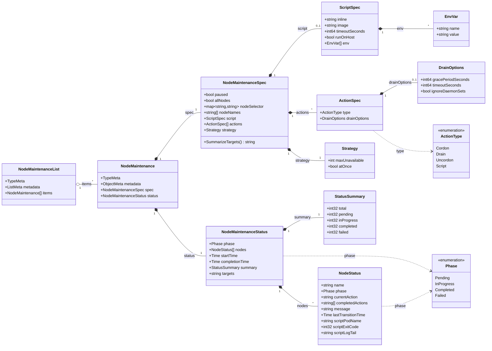
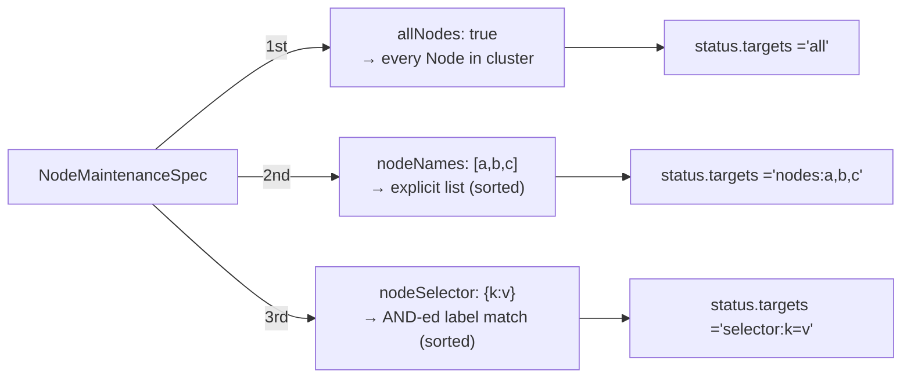
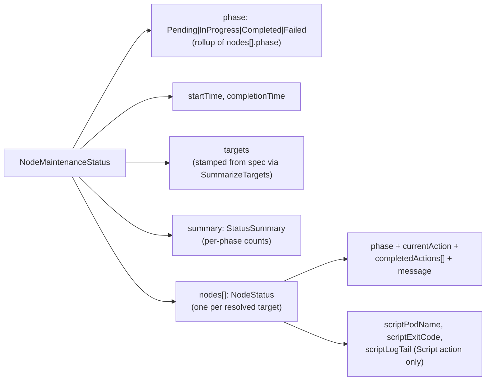
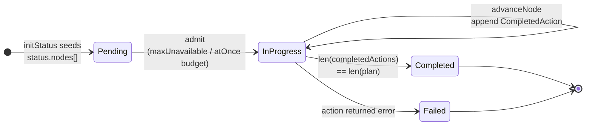

# Types map

A visual reference for the Go types in
[`api/v1alpha1/nodemaintenance_types.go`](../api/v1alpha1/nodemaintenance_types.go) —
who contains who, what each field means, and where each piece of state
ends up in `kubectl get nm`.

This page is the structural counterpart to
[crd-reference.md](./crd-reference.md): that one documents the **YAML
shape and codegen workflow**, this one documents the **Go struct graph**
and is meant to be read with the source open in a split.

## Full class diagram

## Spec side — what the user sets

Target selection is mutually exclusive and resolved in this priority
order (also enforced by the orchestrator at first reconcile):

`SummarizeTargets()` on `NodeMaintenanceSpec` is what stamps
`status.targets` so the printer column populates regardless of how the
NM was created.

### `NodeMaintenanceSpec`

| Field | Type | Default | Notes |
|---|---|---|---|
| `paused` | `bool` | `false` (CRD-level default) | Stops the controller advancing. Used for the attach-then-run CLI flow. |
| `allNodes` | `bool` | `false` (CRD-level default) | Wins over `nodeNames` and `nodeSelector`. |
| `nodeSelector` | `map[string]string` | — | Ignored when `nodeNames` set or `allNodes` true. |
| `nodeNames` | `[]string` | — | Wins over `nodeSelector`. Ignored when `allNodes` true. |
| `script` | `*ScriptSpec` | — | When non-nil and `actions` empty → defaults to `[Cordon, Script, Uncordon]`. |
| `actions` | `[]ActionSpec` | — | Ordered. See default-injection rule above. |
| `strategy` | `Strategy` | `{maxUnavailable:1}` | Concurrency / safety budget. |

### `ScriptSpec`

| Field | Type | Default | Notes |
|---|---|---|---|
| `inline` | `string` | — | Script body. Materialized into ConfigMap `nm-<name>-script` in the runner namespace by the controller. |
| `image` | `string` | `alpine:3.19` | Runner container image. |
| `timeoutSeconds` | `*int64` | `600` | Per-node script execution cap. Min 1. |
| `runOnHost` | `*bool` | `true` | When true, runner uses `nsenter` into PID 1 — host binaries / FS available. When false, runs inside the runner Pod only. |
| `env` | `[]EnvVar` | — | Plain name/value pairs passed to the script. |

> See [script-action.md](./script-action.md) for how `runOnHost` changes
> the runner Pod, and [security.md](./security.md) for why the script
> body is inline-only (no user-managed CM escape hatch).

### `ActionSpec` and `DrainOptions`

| `ActionSpec` field | Type | Notes |
|---|---|---|
| `type` | `ActionType` | One of `Cordon`, `Drain`, `Uncordon`, `Script`. |
| `drainOptions` | `*DrainOptions` | Only meaningful when `type: Drain`. |

| `DrainOptions` field | Type | Notes |
|---|---|---|
| `gracePeriodSeconds` | `*int64` | Forwarded to the eviction. |
| `timeoutSeconds` | `*int64` | Per-node drain deadline. |
| `ignoreDaemonSets` | `bool` | Skip DaemonSet-owned pods. |

### `Strategy`

| Field | Type | Default | Notes |
|---|---|---|---|
| `maxUnavailable` | `int` | `1` | Max nodes in a non-terminal phase concurrently. Min 1. |
| `atOnce` | `bool` | `false` | When true, runs against every target node in parallel — overrides `maxUnavailable`. |

## Status side — what the controller writes

### `NodeMaintenanceStatus`

| Field | Type | Notes |
|---|---|---|
| `phase` | `Phase` | Run-level rollup. |
| `startTime` | `*metav1.Time` | Stamped on first reconcile. |
| `completionTime` | `*metav1.Time` | Set when phase becomes terminal. |
| `targets` | `string` | One-line spec summary; surfaces as the **Targets** printer column. |
| `summary` | `StatusSummary` | Per-phase counts; surfaces as printer columns. |
| `nodes` | `[]NodeStatus` | Frozen at first reconcile from the resolved target set. |

### `StatusSummary`

> None of these use `omitempty` — zero counts must serialize as `0` so
> the **Pending / InProgress / Done / Failed / Total** printer columns
> render literal `0` instead of empty.

| Field | Type |
|---|---|
| `total` | `int32` |
| `pending` | `int32` |
| `inProgress` | `int32` |
| `completed` | `int32` |
| `failed` | `int32` |

### `NodeStatus`

| Field | Type | Notes |
|---|---|---|
| `name` | `string` | Node name. |
| `phase` | `Phase` | Per-node phase (see lifecycle below). |
| `currentAction` | `string` | The action currently executing for this node. |
| `completedActions` | `[]string` | Append-only audit log; `len == len(actions)` ⇒ node `Completed`. |
| `message` | `string` | Human-readable error / context. |
| `lastTransitionTime` | `*metav1.Time` | Bumped on phase change. |
| `scriptPodName` | `string` | Runner Pod for the Script action — used by `kubectl nm logs`. |
| `scriptExitCode` | `*int32` | Pointer so unset and `0` are distinguishable. |
| `scriptLogTail` | `string` | Last ~`Script.LogTailBytes` (default 4 KiB) of runner stdout/stderr, captured before pod GC. |

## Per-node phase lifecycle

The run-level `status.phase` is a rollup of these per-node phases:
`InProgress` while any node is non-terminal, `Failed` if any node ended
`Failed`, otherwise `Completed`.

## Enum types

| Type | Values | Used by |
|---|---|---|
| `ActionType` | `Cordon`, `Drain`, `Uncordon`, `Script` | `ActionSpec.type` |
| `Phase` | `Pending`, `InProgress`, `Completed`, `Failed` | `NodeMaintenanceStatus.phase`, `NodeStatus.phase` |

Both have `+kubebuilder:validation:Enum=...` markers, so the API server
rejects unknown values at admission.

## Methods

| Receiver | Method | Purpose |
|---|---|---|
| `*NodeMaintenanceSpec` | `SummarizeTargets() string` | Renders the spec's target selection (`allNodes` / `nodeNames` / `nodeSelector`) into the one-line `status.targets` value. Truncated at 60 chars. |
| (file-scope) | `truncateForColumn(str, n)` | Unexported helper used by `SummarizeTargets`. |

## Printer-column wiring

What you see in `kubectl get nm` / `kubectl get nm -o wide` and where it
comes from in the Go types:

| Column | JSONPath | Backing field | Default visibility |
|---|---|---|---|
| `Phase` | `.status.phase` | `NodeMaintenanceStatus.Phase` | default |
| `Paused` | `.spec.paused` | `NodeMaintenanceSpec.Paused` | default |
| `Targets` | `.status.targets` | `NodeMaintenanceStatus.Targets` (computed via `SummarizeTargets`) | default |
| `Done` | `.status.summary.completed` | `StatusSummary.Completed` | default |
| `Total` | `.status.summary.total` | `StatusSummary.Total` | default |
| `Age` | `.metadata.creationTimestamp` | `ObjectMeta` | default |
| `Pending` | `.status.summary.pending` | `StatusSummary.Pending` | `-o wide` only |
| `InProgress` | `.status.summary.inProgress` | `StatusSummary.InProgress` | `-o wide` only |
| `Failed` | `.status.summary.failed` | `StatusSummary.Failed` | `-o wide` only |

The three target-selection spec fields (`allNodes`, `nodeNames`,
`nodeSelector`) are intentionally **not** exposed as printer columns —
the `Targets` column already renders all three modes in one place, so
separate columns would leave two of three blank in `-o wide`.

## See also

- [crd-reference.md](./crd-reference.md) — annotated YAML spec + the
  `make generate manifests` codegen workflow.
- [reconcile-flow.md](./reconcile-flow.md) — how this state graph
  evolves tick-by-tick across a real run.
- [architecture.md](./architecture.md) — where these types sit in the
  CLI ↔ controller ↔ action-registry picture.
